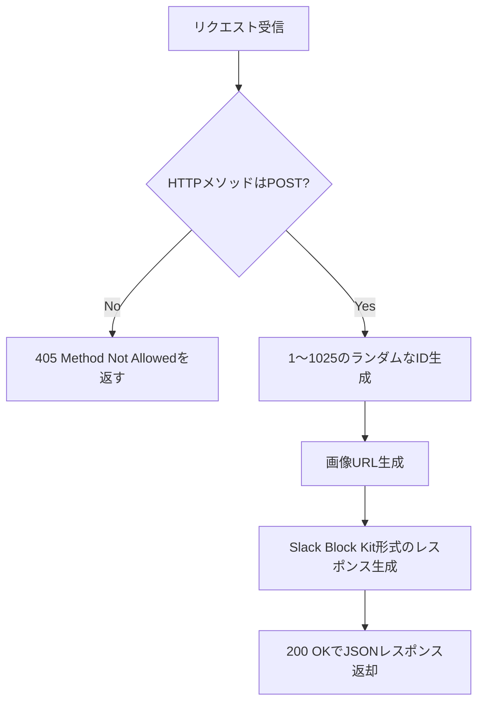

# getpokemon.js 処理フロー

以下はSlack Slash Command用APIエンドポイント（`api/getpokemon.js`）の処理フローです。

## 処理詳細
- リクエストがPOST以外の場合は405エラーを返す
- 1〜1025の範囲でランダムなポケモンIDを生成
- そのIDに対応するポケモン画像URLを作成
- Slack Block Kit形式で画像とテキストを含むレスポンスを構築
- 200 OKでJSONとして返却
