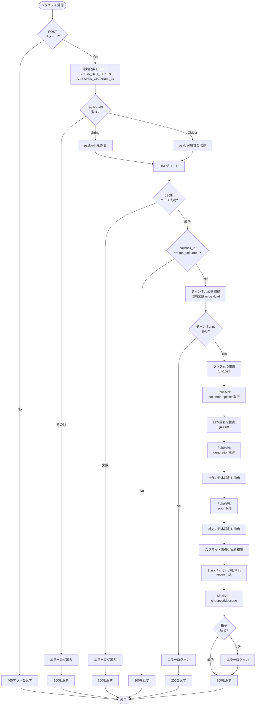

# interact.js フローチャート

## 処理概要

このAPIエンドポイントは、Slackのショートカット機能から呼び出され、ランダムなポケモン情報をSlackチャンネルに投稿します。

### 主要な処理フロー

1. **リクエスト検証**: POSTメソッドかどうかをチェック
2. **ペイロード解析**: Slackから送られてくるpayloadをパースし、callback_idを確認
3. **ポケモン情報取得**: PokeAPIから以下の情報を取得
   - ポケモンの日本語名
   - 世代情報
   - 地方（生息地）情報
   - スプライト画像
4. **Slack投稿**: 取得した情報をSlackのBlocks形式でフォーマットし、chat.postMessageで投稿

### 外部API連携

- **PokeAPI**:
  - `/api/v2/pokemon-species/{id}` - ポケモン種族情報
  - `/api/v2/generation/{id}` - 世代情報
  - `/api/v2/region/{id}` - 地方情報
- **Slack API**:
  - `chat.postMessage` - メッセージ投稿
